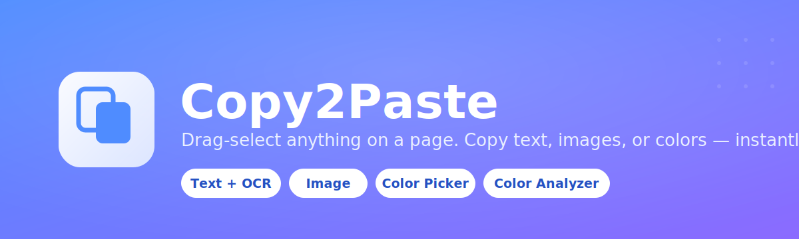
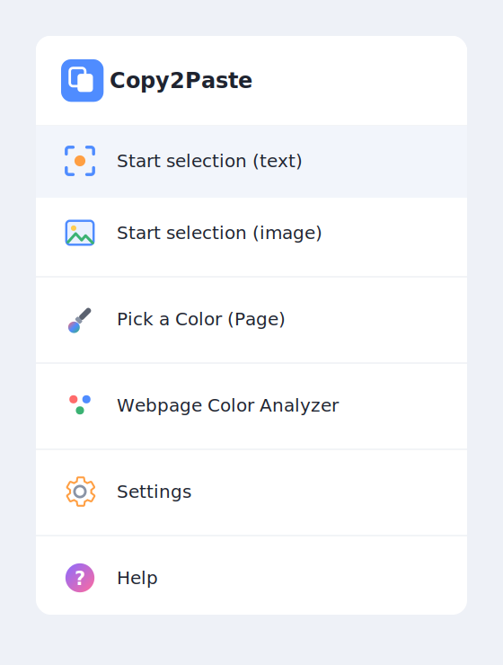

# Copy2Paste



A browser extension that lets you drag-select any area of a webpage —
like Lightshot — and copy what's there straight to your clipboard, as
text (with on-device OCR for text baked into images/video) or as an
image. It also includes a page color picker and a webpage color
analyzer.

Manifest V3 · Chrome / Edge / Brave · No network calls, no accounts, no
tracking — everything runs locally in your browser.

## Features

- **Start selection (text)** — drag a box over any text and it's copied
  as plain text. If the box also touches an image, canvas, video, or
  embedded PDF, it automatically runs a local OCR pass and appends
  whatever text it finds there too.
- **Start selection (image)** — drag a box over anything and copy that
  exact region as a PNG image, pixel for pixel.
- **Pick a Color (Page)** — a zoomed pixel-grid magnifier follows your
  cursor; click any pixel on the page to copy its hex code.
- **Webpage Color Analyzer** — scans the whole rendered page and lists
  every color actually in use (backgrounds, text, borders) as clickable,
  copyable swatches, sorted by frequency.
- **Optional keyboard shortcuts** for every action, assignable per-user
  (none set by default).
- **Local OCR** via [Tesseract.js](https://github.com/naptha/tesseract.js),
  bundled with the extension — no server, nothing leaves your machine.
- **Feedback form** built in — Bug report / Feature request / General
  feedback, posted straight to a Discord webhook.

## Install

This isn't published to the Chrome Web Store — load it as an unpacked
extension:

1. Clone or download this repo.
2. Go to `chrome://extensions` (or `edge://extensions`).
3. Turn on **Developer mode** (top-right toggle).
4. Click **Load unpacked** and select this folder.
5. Pin the extension (puzzle-piece icon in the toolbar → pin Copy2Paste).

> **First-time gotcha:** right after loading, your active tab is often
> still `chrome://extensions` itself — and extensions aren't allowed to
> run on Chrome's internal pages. If you click the icon there and nothing
> happens (you'll see a red **!** badge), just switch to any normal
> website tab and try again.

### Wiring up the feedback form (optional, one-time)

The **Feedback** menu item posts to a Discord webhook. To receive
submissions:

1. In Discord: Server Settings → Integrations → Webhooks → New Webhook →
   Copy Webhook URL.
2. Open `feedback.js` and paste it into the `DISCORD_WEBHOOK_URL` constant
   near the top of the file.

Until this is set, the form shows a clear "not wired up yet" message
instead of silently failing.

## Usage



Click the toolbar icon to open the menu — no keyboard shortcuts are set
by default, so this always works with zero setup. If you want faster
access to any action, assign your own shortcut from **Settings** (which
links directly to Chrome's shortcut editor at
`chrome://extensions/shortcuts`):

| Action | Shortcut |
|---|---|
| Start selection (text) | *(none by default — set your own)* |
| Start selection (image) | *(none by default — set your own)* |
| Pick a Color (Page) | *(none by default — set your own)* |

Drag a box, release to copy, `Esc` to cancel anytime.

<br clear="right"/>

## How it works

| Feature | Technique |
|---|---|
| Text selection | Walks the page's text nodes with `TreeWalker`, testing each *word* individually against the drag box using its rendered center point — not whole-element bounding boxes — so partial overlaps don't pull in unrelated text. |
| Image selection | `chrome.tabs.captureVisibleTab()` cropped to the drag box via `<canvas>`, then written to the clipboard as a PNG blob. |
| OCR | The selection is screenshotted and cropped the same way, then sent to a hidden [offscreen document](https://developer.chrome.com/docs/extensions/reference/api/offscreen) running Tesseract.js — offscreen documents give the Manifest V3 service worker a real page context (Web Workers + WASM) it can't provide on its own. OCR only runs when the selection actually overlaps an ``, `<canvas>`, `<video>`, `<svg>`, `<embed>`/`<object>` (e.g. an inline PDF), or a CSS background-image, so ordinary text copies stay instant. |
| Color picker | Same screenshot-and-crop technique, sampled live as your cursor moves, re-capturing periodically (throttled to Chrome's ~2 calls/second screenshot limit) so `:hover` color changes are eventually reflected. Deliberately doesn't use the browser's native `EyeDropper` API — its magnifier UI is inconsistent across operating systems. |
| Color analyzer | Walks every element on the page, reads `getComputedStyle()` for background/text/border colors, and tallies frequency. |

## Known limitations

- **Native PDF viewers** (a `.pdf` opened as its own tab, Chrome's
  built-in viewer, Adobe's extension) render pages as graphics with no
  real DOM text — text mode can't work there in principle, and browsers
  also restrict extension access to their built-in viewer. Use **Start
  selection (image)** instead for those. PDFs *embedded inside* a normal
  webpage (`<embed>`/`<object>`) are supported via the OCR fallback.
- **Text mode** matches by word center-point, so a word sitting right on
  the edge of your drag box can go either way — the same ambiguity native
  browser text selection has at line boundaries.
- **OCR** quality depends on the source image — clear, reasonably sized
  text reads well; small, blurry, or stylized text may come out
  imperfect. For video, it reads a single frame at the moment you
  release the drag, so pause first for best results. DRM-protected video
  renders black in screenshots by design, so there's nothing to read.
- **Color picker** only samples within the current browser tab, not
  other windows or your desktop — that's the trade-off for not depending
  on the inconsistent native `EyeDropper` API.
- Extensions can never run on `chrome://`, the Chrome Web Store, or other
  browser-internal pages — this is a platform restriction, not specific
  to Copy2Paste.

## Project structure

```
copy2paste/
├── manifest.json          # Manifest V3 config, permissions, commands
├── background.js          # Service worker: routing, screenshots, offscreen doc lifecycle
├── content.js             # Injected into pages: selection UI, text/OCR extraction, color tools
├── content.css            # Styles for the in-page overlay, magnifier, toasts, panels
├── popup.html / .js / .css   # Toolbar menu
├── options.html / .js / .css # Settings page (shortcuts)
├── help.html               # In-extension usage guide
├── offscreen.html / .js    # Hidden document that runs the Tesseract.js OCR engine
├── vendor/tesseract/       # Bundled Tesseract.js engine + English language data
├── assets/                 # README images
└── icons/
```

## Privacy

No analytics, no external requests, no accounts. Screenshots and OCR all
happen locally in your browser; nothing is ever uploaded anywhere.

## License

Add whichever license you'd like this repo to carry (e.g. MIT) — none
is specified yet.
